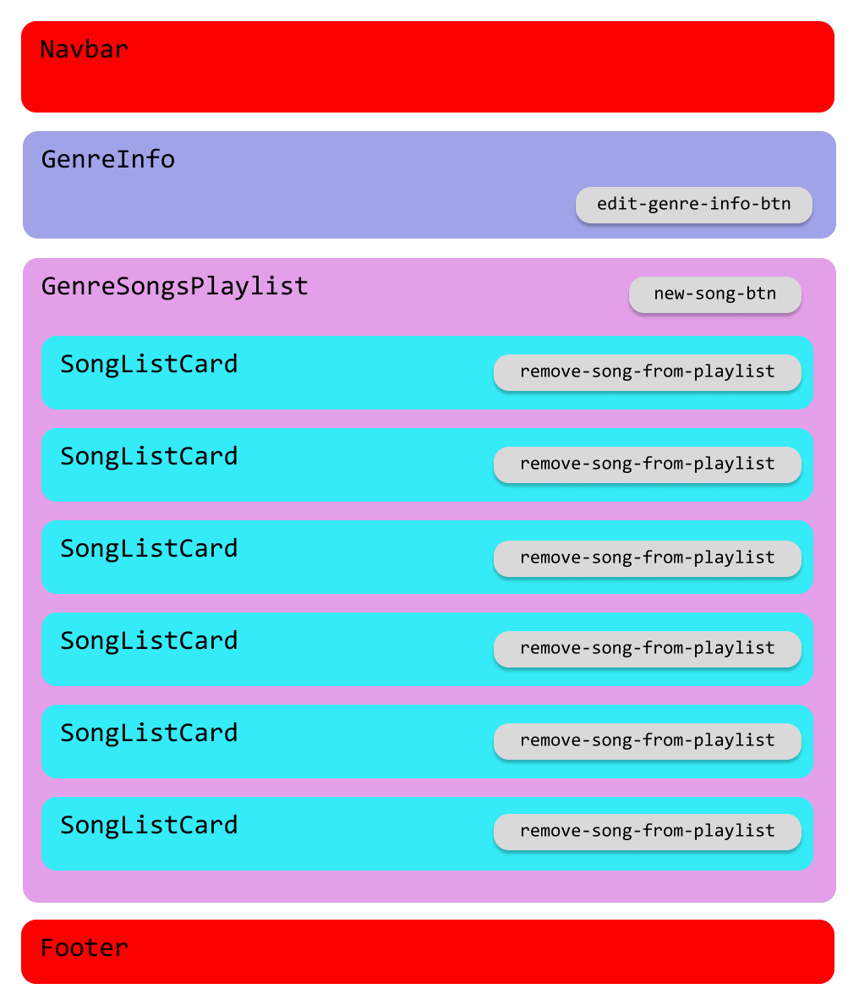

# Single page APP

**MUSIC GENRES** 

La app tiene como cometido ser un recomendador de canciones por Géneros con el que los usuarios puedan interactuar de 2 maneras:

- Añadir o Editar o Borrar Géneros
- Añadir o Editar o Borrar Canciones pertecientes a un Género

Los Géneros contendrán información relativa al mismo y un listado asociado 

## CRUD principal (genres)

Va a contener:
- Nombre del Género (`String`) `name`
- Cultural Origins (`Object`)(`{date: Number, countries: [String]}`) `origins`
- Info sobre el Género (`String`) `description`
- Grupos más representativos del mismo (`Array de Strings`) `linkedBands`
- Popularidad / Valoraciones de los usuarios de la APP (de 1 a 5 estrellas) (`Number`)`rate`
- ¿Es muy popular actualmente? (`Boolean`)`isMainstream`
- ¿Es padre de otros Géneros? (`Boolean`)
  - Géneros hijos (`Array de Strings`)`childrenGenres`
- Galería de fotos basada en el Género (`Array de Strings`) `imagesUrl`

## CRUD secundario (songs)
- Título (`String`) `title`
- Género al que pertenece (`Number`) `genreId`
- Autor o Grupo (Nombre, Web o Wikipedia, Pais) (`Object`) (`{name: String, link: String}`) `songBy`  
- ¿Es Single o incluido en LP? (`Boolean`) (`radio button`) `single`
  - Si es incluido en LP -> Disco al que pertenece esta canción (`String`)`inAlbum`
- Portada (`String`) `coverUrl`
- Vídeo (URL de Youtube) (`String`) `videoUrl`
- ¿Está en activo? (`Boolean`) `isBandActive`
- Popularidad entre los usuarios de la APP (de 1 a 5 estrellas) (`Number`)

---- 

## SITE MAP

```
App/
│
├──HomePage/[Home]
│
├──GenresListPage/[Genres]
│     │
│     └─GenreCardPage/[:genreId]
│
├──SongsListPage/[Songs]
│     │
│     └─SongCardPage/[:songId]  
│
└──AboutUsPage/[About us]
```

## COMPONENTS

- Navbar [Navbar]
  - Brand 
  - GenresSearchBar [Form]
  - FiltersSubmenu [Offcanvas]
- Footer
- NewGenreForm
- EditGenreForm
- NewSongForm
- EditSongForm
- GenresList
- GenreListCard
- GenreCard
- SongsList
- SongListCard
- SongCard
- SongVideoPlayer [https://www.npmjs.com/package/react-player]
- SidebarPlaylistPlayer [***]

### COMPONENTS

#### 1. GenreCardPage

- GenreInfo
- GenreSongsPlaylist
- SongListCard

<details>
<summary>Open diagram</summary>
  <div style="display: flex; justify-content: start">
    
  </div>
</details>